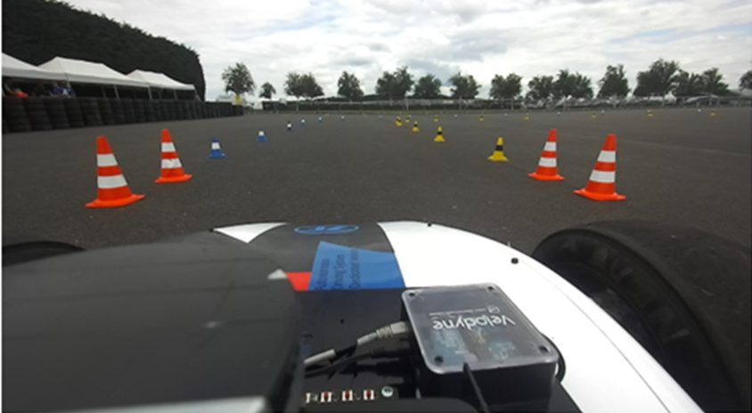
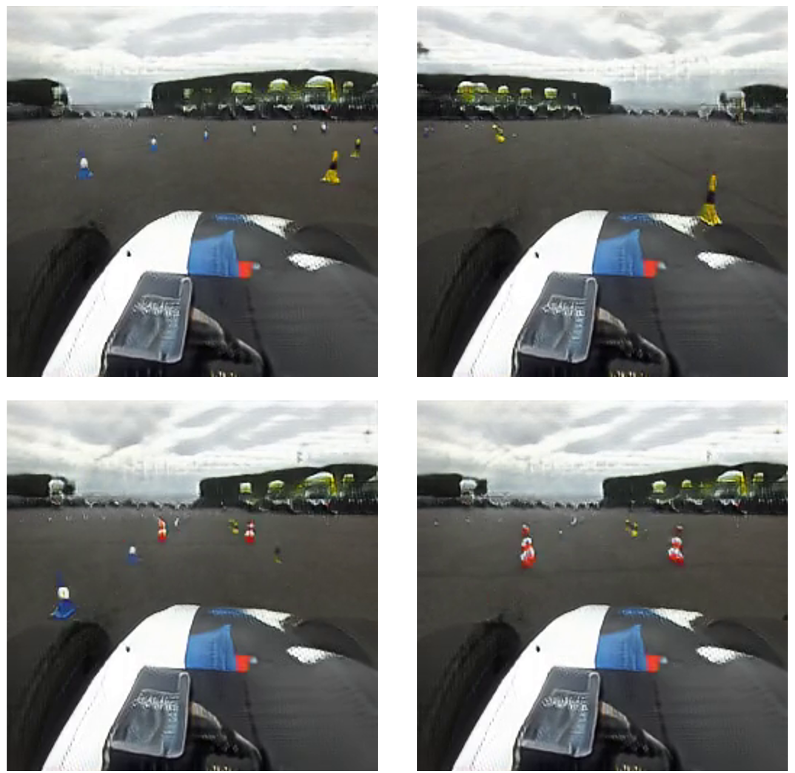
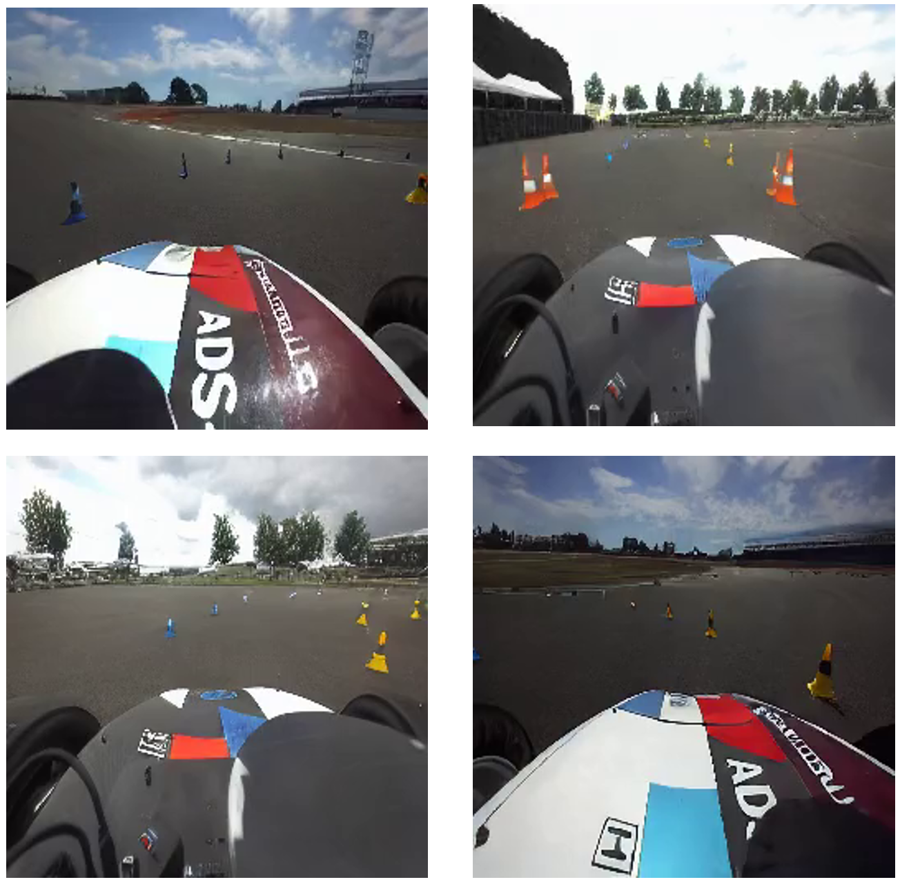
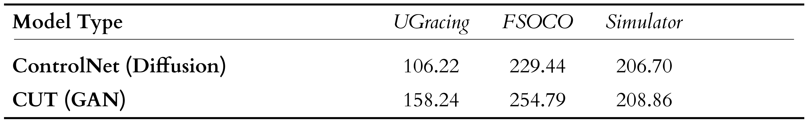
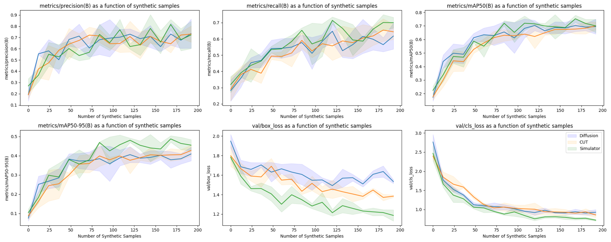

# Exploring Generative AI for Autonomous Driving

This repository contains code used throughout my 4th year Dissertation. It explored the idea of utilising the recent advances in Generative AI to increase the fidelity of simulated environments, closing the Sim2Real gap.

The following is a very brief summary of the 38 Page Dissertation along with some technical details.

## Background

### Formula Student AI

Formula Student AI sees teams develop software solutions to autonomously navigate a shared car around an unknown track at Silverstone. I am a former member of the University of Glasgow team in which we finished 3rd in both 2023 and 2024.

The competition is run in a 'time-trail' fashion, with tracks consisting of blue and yellow traffic cones that denote the boundaries. The autonomous system then has to detect these cones, determine a path through the environment and execute the plan. This combination of real-world problems makes this a very challenging robotics competition. For context, see the image attached below.



### Motivation

This dissertation focused on the effectiveness of simulating camera data using Generative AI in the context of Formula Student as the simulator the team used at the time failed to produce images that were representative of the real-world with traditional rasterisation techniques.

In this context, our goal is to generate images that **(1)** are representative of the real world environment and **(2)** contain cones that appear both correct and in the correct place in the image.

## Approach

This project compared the following distinct Generative AI methods: 
- Latent Diffusion (ControlNet)
- Generative Adversarial Networks (Contrastive Unpaired Translation)

 
Each model is conditioned on simulator outputs:

The GAN model converts directly from the simulator image domain to the real world, without any need for an additional conditioning mechanism. This also makes the model trivial to train as you only need samples from each image distribution to train the network.

The Latent Diffusion model is conditioned using a semantic segmentation mask derived from the simulator. This means we have to train on paired data, this is achieved by auto-annotating a dataset gathered from the car at the competition


## Results

### Qualitative

The following are novel views sampled from the GAN and Diffusion Models using simulator data:

| GAN    | Diffusion |
| -------- | ------- |
|   |     |

### Quantitative - FID

The Diffusion model displays considerably higher realism. This is reflected in the FID metric, here the different headings denote different datasets:



Addressing goal **(1)**, we can see that the generative models are far 'closer' to the real world image domain than the simulator images. Additionally the Diffusion model outperforms the GAN approach, this can also be observed in the model samples.

### Quantitative - Supplementing Dataset

So far we have validated requirement **(1)**, in order to validate requirement **(2)** we supplemented a YOLO training dataset with synthetic samples in order to determine if the generated samples could improve the task of traffic cone detection and classification.



This shows that the addition of synthetic data to the training dataset actually results in an increased performance on an unseen real-world dataset.

## Future Work

There are many directions this work could be taken in, especially with the rapidly increasing quality of Generative AI, it is likely real-world robotics applications will be considering this approach for their simulation stack.

A long term goal for project that follow this is to train AI agents in a simulated environment (can typically take thousands of hours), and have knowledge gained generalise into the real world. This has already been explored with CycleGAN architectures and robotics in RT-1 and RT-2. 

## Repository Structure

The repository is structured as follows:

```
.
├── data                  # Data pre-processing scripts, Auto-annotation and Visualisation
├── eval                  # Evaluation scripts and Graphing notebooks
├── gan                   # Submodules for CUT and CycleGAN approaches
├── img                   # Images for the README
├── ldm                   # Diffusion ControlNet and OpenShift GPU cluster configuration
├── sim                   # Unity simulator for conditioning models and generating data
├── LICENSE
└── README.md
```
